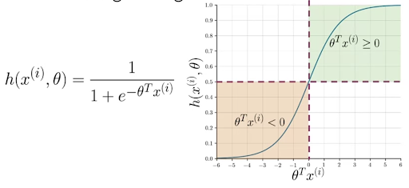

# Logistic Regression to perform Sentiment Analysis 

## Supervised Machine Learning

## Logistic Regression 

For Logistic regression F is sigmoid function which outputs 0-1 value

  
   

**Training the Model** 

We initialize random parameters theta and then iteratively update the values by calculating the cost functions gradient. 

  
   

**Model Prediction and Metrics** 

The above process gives us the best possible theta value. Now we predict

Then we validate predicted and actual y values. Total number of correct predictions / Total number of observations = accuracy 

**Gradient Descent and Cost Function** 

Gradient descent is an iterative optimization algorithm, which finds the minimum of a differentiable function. In this process, we try different values and update them to reach the optimal ones, minimizing the output.

Cost Function

m = number of training samples
-ve sign is to make overall cost a positive number 
first term = label * log ( prediction of logistic function ) - cost goes up when p=label is 1 and pred is close to 0 
second term = ( 1- label ) * log ( 1- prediction) - cost will blow up when label is 0 and we predict close to 1
When the label is 1 , the first term is important and when the label is 0, the second term is important. 

  
   

When the label is 1 and prediction is 1 , the loss is very less. But when the prediction is 0, loss is very high. 
SImilarly in the second graph, when label is 0 and prediction is 0, loss is low. 

**Modeling Steps** 
1) You first initiate the weights values (theta) 
2) You then predict the y values using these weights and X test 
3) Then you calculate the loss using y predict and y label 
4) Then you calculate the gradient(derivative of cost wrt to weights)  and update the weights (with some learning rate) 
5) Repeat till loss is not changing for multiple iterations 

## Data Processing for Sentiment Analysis 

### Data Encoding 

**Method 1)** 

You have a vocabulary and you can use that to convert any text into vectors of 0 and 1. To create the vocabulary, you just accumulate all the text you have and see how many different words are there. 

**Method 2)** 

### Feature Extraction 

