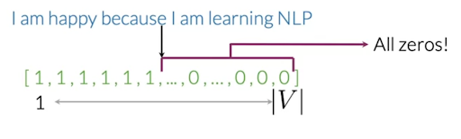

# Logistic Regression to perform Sentiment Analysis 

## Supervised Machine Learning

## Logistic Regression 

For Logistic regression F is sigmoid function which outputs 0-1 value

  
  
   

**Training the Model** 

We initialize random parameters theta and then iteratively update the values by calculating the cost functions gradient. 

  
  
   

**Model Prediction and Metrics** 

The above process gives us the best possible theta value. Now we predict

Then we validate predicted and actual y values. Total number of correct predictions / Total number of observations = accuracy 

**Gradient Descent and Cost Function** 

Gradient descent is an iterative optimization algorithm, which finds the minimum of a differentiable function. In this process, we try different values and update them to reach the optimal ones, minimizing the output.

Cost Function

- m = number of training samples
- Negative sign is to make overall cost a positive number 
- first term = label * log ( prediction of logistic function ) - cost goes up when p=label is 1 and pred is close to 0 
- second term = ( 1- label ) * log ( 1- prediction) - cost will blow up when label is 0 and we predict close to 1
- When the label is 1 , the first term is important and when the label is 0, the second term is important. 

  
  
   

When the label is 1 and prediction is 1 , the loss is very less. But when the prediction is 0, loss is very high. 
SImilarly in the second graph, when label is 0 and prediction is 0, loss is low. 

**Modeling Steps** 
1) You first initiate the weights values (theta) 
2) You then predict the y values using these weights and X test 
3) Then you calculate the loss using y predict and y label 
4) Then you calculate the gradient(derivative of cost wrt to weights)  and update the weights (with some learning rate) 
5) Repeat till loss is not changing for multiple iterations 

## Data Processing for Sentiment Analysis 

### Data Encoding 

**Method 1)** 

You have a vocabulary and you can use that to convert any text into vectors of 0 and 1. To create the vocabulary, you just accumulate all the text you have and see how many different words are there. 

  
  
   

Here the issue is that the logistic model has to learn a large number of sparse features ( = size of vocabulary) and this requires huge computation time and reduces accuracy. 

**Method 2)** 
Here we keep track of the number of times a word comes in the positive class and the number of times it comes in the negative class. Then we use this frequency count to make features. 

Creating the Vocabulary from the corpus and then creating the positive and neg freq dictionaries from the vocabulary. 

  
  
   

### Feature Extraction 
We create a 3 dimentional feature where the first term is bias (always 1) and the second term is the sum of positive frequencies of each word and third term is the sum of negatiive frequencies. 

  
  
   

The matrix is of size (m,3). You have m samples of tweets and 3 features. 

log positive count = log(positive count of word + 1) 

# Twitter Sentiment Analysis

## Preprocessing Steps 
1) Check the imbalance in dataset - do pie chart positive vs negative tweets 
2) Check for nan/missing strings or missing y variables 
3) Removing some common retweet text, hyperlinks , hashtags - using ‘re’ regular exp
4) Lowercasing - we do this before or inside the tokenization function - or else the same word in different cases will be tokenized twice. 
5) Tokenizing the string - convert the string into words without spaces
6) Removing stop words and punctuation
7) Case based processing - Here emojis need to be in the data but in non sentiment analysis cases we can remove them. In some cases, certain stop words might need to be included. Then change the stop words list. 
8) Stemming or Lemmetization

All of this can be done in one step from : **from utils import process_tweet

## Extracting Features : 
1) Now you have a dataset with each tweet in the form of a list of important words 
- ['followfriday', 'top', 'engag', 'member', 'commun', 'week', ':)']
2) Now split the data into training and test datasets. All below stuff should be on the training dataset. 
3) Now create a frequency dictionary. The key is a tuple (word, label). The value is the number of times the word appeared in that particular label. 
- Say there is a positive labelled tweet with word ‘shreya’ coming 2 times. 
- Then there is a negative labeled tween with same word ‘shreya’ coming once 
- The frequency table will be : (‘shreya’, 1.0)= 2, (‘shreya’, 0.0) =1 
- All of this can be done in one step from : **from utils import build_freqs

  
  
   

4) Now one way to model is to have a feature list which is the size of the number of unique words in freqs dictionary…and then have a 1 , 0 values depending on the words occurrence in the tweet. But this becomes a very sparse matrix 
- Alternatively, we can extract features from the freqs dictionary: 
    - The first feature is the number of positive words in a tweet.
    - The second feature is the number of negative words in a tweet.

5) Example 
  tweet = [‘followfriday’, ‘top’, ‘jame’] 
  x = [1, 60 , 21] (Assume (top, 0) is 21 and jame does not occur in neg labels. 
  1 - is the bias term. we have corresponding theta0 for it 
  We do this for all of the tweets ( m) - we get X(m*3) 

## Training and Prediction 
6) Apply gradient descent to the entire training dataset, to get the optimat theta values. 
7) Now when a new test tweet comes in , you need to extract the x features for that tweet and then predict the y value  ( do this for each test tweet individually) 

8) Accuracy => 
- Y pred is a fraction. 
- Y_hat = 1 if y_pred > 0.5 and 0 if y_pred< 0.5
- accuracy = (y_hat - y_test_labels).sum()/m 

