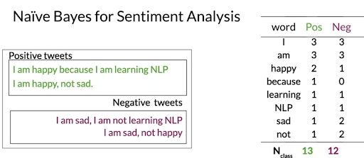
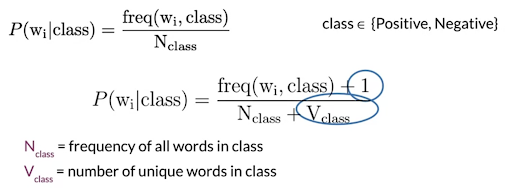
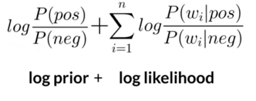
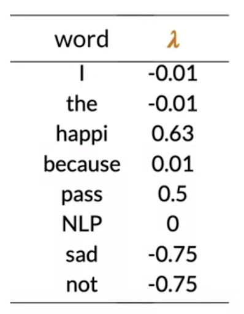

# Naive Bayes for Sentiment Prediction

## Training Naive Bayes Model 

1) We have a corpus of tweets with positive and negative labels. Do the required text pre-processing. 

        Lower case -> Remove punctuation, urls , stop words -> Tokenizing -> Stemming

2) Now we have a clean corpus. Now create a vocabulary of all words in the tweets and two columns pos and neg which add up the number of times each word occurred in pos and neg tweet. 

3) Calculate the conditional probabilities of each word using the laplacian smoothing formula. 

4) Calculate the log of the ratio of conditional probabilities to get the lambda values 
5) Calculate the log prior. ( no positive tweets/no neg tweets ) This is 0 in a balanced dataset but if the dataset is imbalance, this can be very important. 

  
  
   

Now to test the model on a unseen test tweet dataset : 
Preprocess the tweet -> Lookup for the word in the LL dictionary. -> If the words dont exist , make their lambda 0 -> if word exists, add those lambdas to the log prior = Score

**TWEET HAS POSITIVE SENTIMENT : LOG PRIOR + Log Likelihood) Score  > 0**

