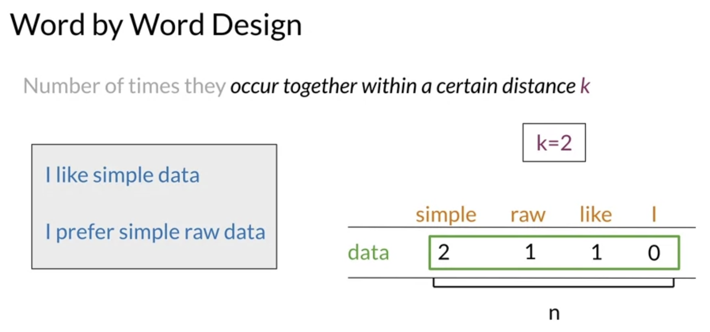
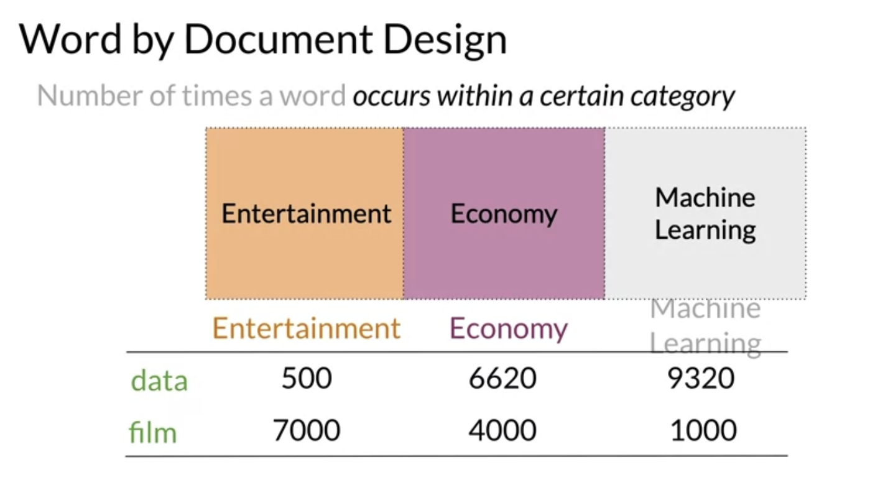
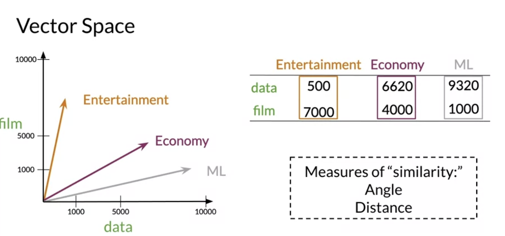
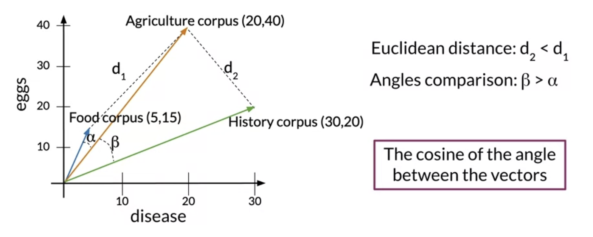
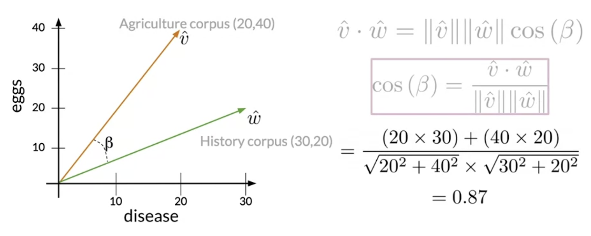

# Vector Space Models 

So far we have used only frequency of words to understand text data. But this does not tell us the relative meaning of words in sentences. Hence we need to look at vector space models which are used to represent text as a vector of identifiers. 

**Why do we need vector space models? Where do we use them ?** 

Sometimes, sentences with similar words can mean different things and sentences with completely different words can have the same meanings. In such cases vector space models can help us identify if both the sentences mean the same irrespective of the words in them.We use them to find similarity between sentences. 
- Question answering 
- Paraphrasing
- Summarizing 

They can also be used to capture dependencies between words in a sentence. They are helpful in answering questions with "who? what? how?" questions.  
- Information extraction
- Machine translation 
- Chatbot programming 

### Co-occurrence matrix

The matrix helps get vector representations of words.  Here the vector representation of data will be v=[2,1,1,0].
K = Bandwidth

  
  
   

## Similarity 

We can see that the economy and ML are similar. This is a 3 dimensional vector space. 

**Euclidean Distance** : Length of straight line connecting the vectors. 

**Cosine Similarity** : Unlike Euclidian distance, this is independent of the size of the corpuses like euclidian distance. Eg. Food and Agriculture corpus are similar but euclidian says they are apart. 

## Cosine Similarity Score 

  
  
   

