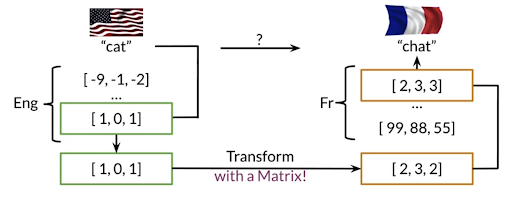

# Machine Translation and Document Search 

- Machine Translation - If we know some words in english and we want to know the equivalent ones in french, we can use NLP to convert. 
- Document Search - Given a document, we can search for similar documents using NLP. 

## How to do Machine Translation
STEP1)  Get an extensive list of word embeddings associated with english and french.

STEP2)  Get the word embedding of your word in english and convert to the french word vector space by multiplying with a transformation matrix. 

- Calculating R : R is the english to french transromational matrix. We can get this by training on a known english and french vector list. Here the loss is Frobenius norm

STEP3)  Then convert the french word vector to actual french word 

- To convert the french vector to french word, we can use the **K nearest neighbors algorithm** where we calculate the distance of this vector to all other word vectors in the french corpus and choose the nearest one.
- But this might take a lot of time, so we need to subset the french corpus in some way so that we can search in the right bucket to get the appropriate word. We use **Locality sensitive hashing** to get a subset of words which might be the nearest ones to the vector and this saves a ton of computation time. This method is called **Approximate Nearest Neighbors** 

  
  
   

## Approximate nearest neighbors

This algorithm does not give the exact nearest neighbor but gives us a subset which might have the exact nearest neighbor. It usually trades off accuracy for efficiency and uses locality sensitive hashing to do this 

## Hash Function and Hash tables

## Locality Sensitive Hashing 

  
  
   

